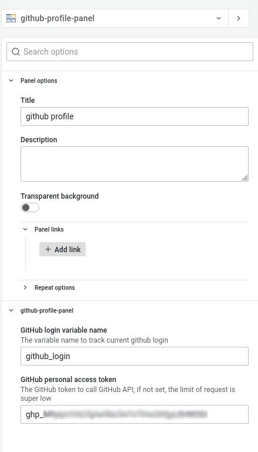

# Simple GitHub Profile Panel

## What is GitHub Profile Panel Plugin?

A simple panel plugin to display developer's GitHub profile. Set up a variable to monitor on github login, then the panel will display developer's login, name, joined date, bio and other basic info.

Parts of the code and figures are yanked from [Rondoo - GitHub user search app ](https://github.com/Javiersalcedoj/GitHub-User-Search-App), since it's published without a LICENSE, this project will be modified according to any of the original project's license update.

## Getting started

Set up the `GitHub login variable name` in the panel's option, and update the variable anywhere you want the profile panel to display the according developer profile.

